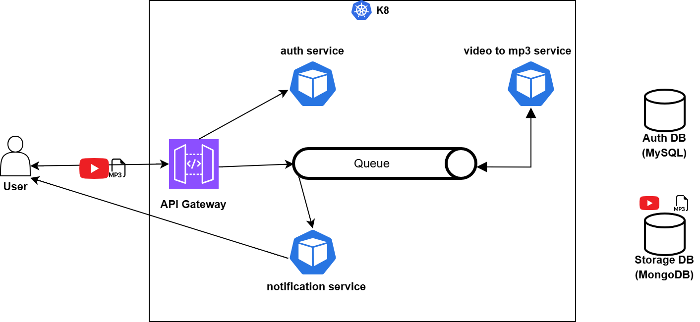

## Video to audio converter Project with Python and Kubernetes

This is a Project that I've developed based on some tutorials about microservices architecture using Python(flask),Docker,Kubernetes, RabbitMQ, MongoDB, and MySQL becuase of personal interests in DevOps, System Architecture, python programming languge and web technologies.

You can see the overall architecture in the below diagram.




We have used minikube as the cluster manager.
We have also used the minikube tunnel with the configuration inside /etc/hosts for the ingress settings.

settings will be like this inside the /etc/hosts
```sh
127.0.0.1 mp3converter.com
```

each service consists of a Dockerfile which should be built and pushed to the container registery after logging in Dockerhub.

```sh
docker build .

docker tag image_local_name_or_id  containerRegisteryName:tag

docker push containerRegisteryName:tag
```

The images will be pulled by the kubernetes deployment or statefulset.

inside the manifests folder of each service we have to apply the resources :

```sh
kubectl apply -f .
```

for deleting we use:

```sh
kubectl delete -f .
```
for troubleshooting we would use:

```sh
// for checking application erros inide pod/container

kubectl logs -f <pod_name> 

// for kubernetes specific errors:

kubectl describe deployment <deployment_name>
```
